My project is a gesture controller robot. The robot is controlled by an Arduino hand gesture control that can be worn on the hand. The control works through bluetooth, and the robot can turn in all directions with its 4 wheels.


| **Engineer** | **School** | **Area of Interest** | **Grade** |
|:--:|:--:|:--:|:--:|
| Liyuna C | Basis Independent Silicon Valley | Mechanical Engineering | Incoming 8th Grader

<!--- **Replace the BlueStamp logo below with an image of yourself and your completed project. Follow the guide [here](https://tomcam.github.io/least-github-pages/adding-images-github-pages-site.html) if you need help.**-->

<p align="center">
  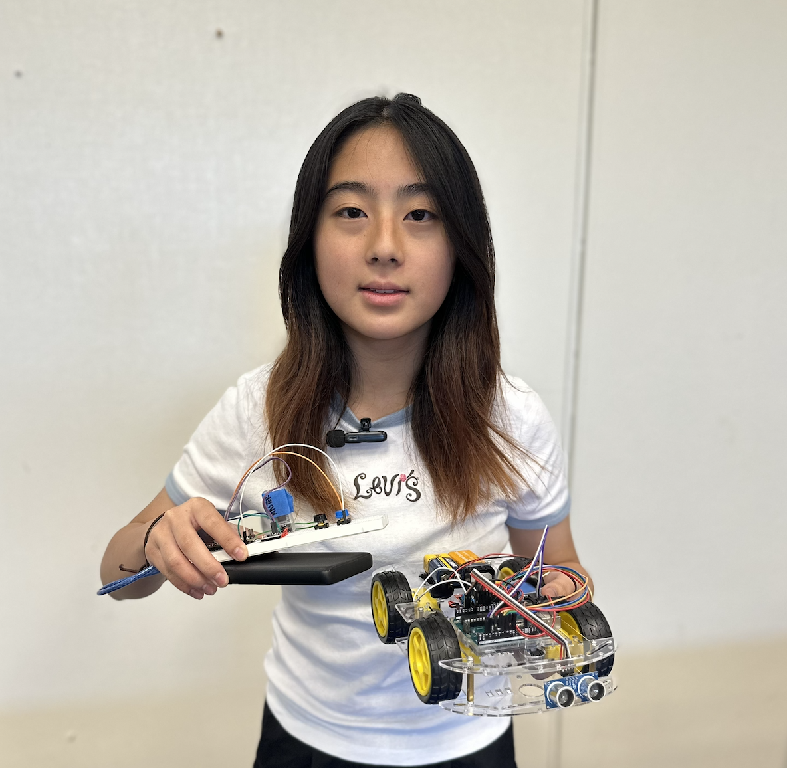
  <br>
</p>
  
# Modification Milestone

<iframe width="560" height="315" src="https://www.youtube.com/embed/zWHB_-CpgyA?si=x_t3iwuCeQxetkr_" title="YouTube video player" frameborder="0" allow="accelerometer; autoplay; clipboard-write; encrypted-media; gyroscope; picture-in-picture; web-share" referrerpolicy="strict-origin-when-cross-origin" allowfullscreen></iframe>

## Description

For my modification milestone, I added a total of 4 modifications. Here are what they are:

**Spin feature:** The first modification I added was a spin feature. By spinning the control in a circle, the robot would spin 360. I added this modification by first adding code to the robot to have one side spinning forward and the other spinning backward. This would result in a 360 spin. The controller code was more complicated, because I had to use buffers, which are used to temporarily store information. I did this by creating an array that has 3 slots and remember the last 3 different gestures. If the current gesture is right, the code will access the array and see if the last 3 gestures complete a circle. If this is true, the robot will do a 360 turn. While this worked, it was harder to control, so I added a button that would make it spin in a circle as well.

**Button:** The second modification I added was a button that repeats the last 4 movements. I did this by first wiring the button and testing it. Then, I added a buffer, similar to the one used in the spin modification, and had it repeat the last 4 movements if the button was pressed. The major difference between the code for the button and spin feature is that I utilized the modulus operator much more in the button code. The modulus operator, which, if written as "a%b" returns the remainder as the output (refer to Final Controller Code with Modifications). It was useful because it allowed me to simplify my code by going through every possible combination of characters without writing hundreds of lines of code.

**Speed control:** The third modification I added was the ability to control the speed based on the degree of the tilt. This was also a change in code, as I added multiple settings so that a steeper tilt would result in a higher speed.

**Ultrasonic Sensor:** The fourth modification I added was an ultrasonic sensor. I first wired the sensor in, then tested it, and, finally, added code so it would somewhat control the robot.


## How it works

**HC-SR04:** The HC-SR04 is an ultrasonic sensor. Ultrasonic referes to sound waves that are ultrasound, meaning their frequency is higher than 20,000 Hz, which is the highest frequency a human can hear. Ultrasonic sensors measure distance by using this. The sensor sends a ultrasonic sound wave through its Trigger pin, and then it measures how much time it takes the sound to bounce back to the Echo pin, which receives the sound. Because distance is speed multiplied by time, ultrasonic sensors are able to calculate the distance by multiplying the speed of sound, which is 340 m/s, by how long the "bounce back" lasts.

<p align="center">
  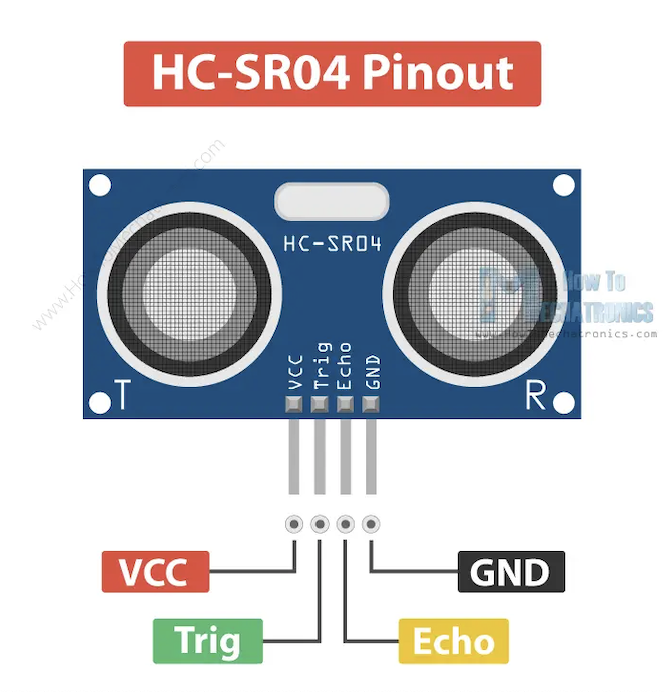
  <br>
  <small> figure 11: an ultrasonic sensor with 4 pins: vcc, trig, echo, and gnd</small>
</p>

**Button:** The button works by being connected to two pins, with one being the ground pin. The Arduino is able to detect when the button is pressed because the ground sends current, and if the button is pressed down current goes through and the second pin receives the current. This is how the Arduino can detect the button. 
<p align="center">
  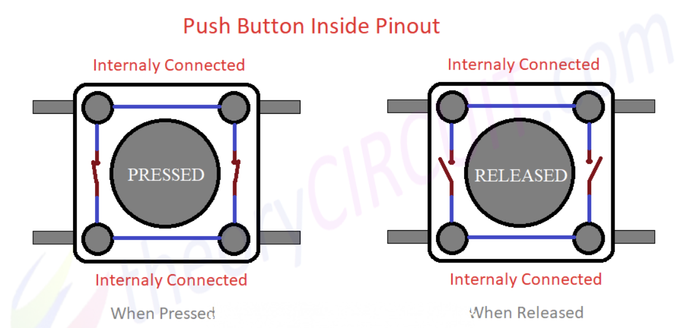
  <br>
  <small> figure 12: diagram describing how a pushbutton works</small>
</p>

## Challenges

**Detecting circle:**
At first, I had trouble writing code so that the accelerometer could detect a circle. Therefore, at first, I wrote code so that it only had to have a tilt that went forward and left. This was much simpler than creating a buffer and adding many lines of new code. However, after finishing a couple more modifications, I went back and added the memory feature to my code. As said before, it was inconsistent, though, so I added a button like the one in the memory feature.

**Changing speed:**
While changing speed, I first set the slower speed 150. I found that this was too slow, and the wheels would just vibrate back and forth instead of spinning. I fixed this by setting the speed higher.

**Ultrasonic Sensor:**
The first issue I faced was while wiring the Ultrasonic Sensor. This was a challenge because, to be powered, the sensor needs 5V. This was a problem because the 5V pin was occupied in my Arduino board by the HC-05. I wasn't sure what to do because powering it by a seperate power supply would be difficult. However, I remembered that the HC-05 could be powered by either a 5V or a 3.3V. Therefore, I rewired the HC-05 so that it was connected to the 3.3V pin and GND. I was then able to power the sensor. There are two other pins that should be connected, and, after doing some research, I found that they are commonly connected to pins 9 and 10. However, these were occupied as well. This had a simple fix, though, because I remembered that the Software Serial library allows you to set pins. Refer to figure 1 to see how exactly the pins are wired.

**Remembering and Repeating Previous Motions:**
To add the button feature, I added for loops and if statements so that the code would identify which gestures were last used and repeat it. However, at first, when I did this, the robot responded by going in a direction for a second and stopping. I went back and changed the code so that the buffer would not add 'stop' when updating. This was so that the robot didn't use stop as all 3 gestures that it was trying to repeat. However, this did not completely resolve the issue. Later, I added 'delay's so that the gestures wouldn't be repeated consecutively with only milliseconds of running.

## Images 
<p align="center">
  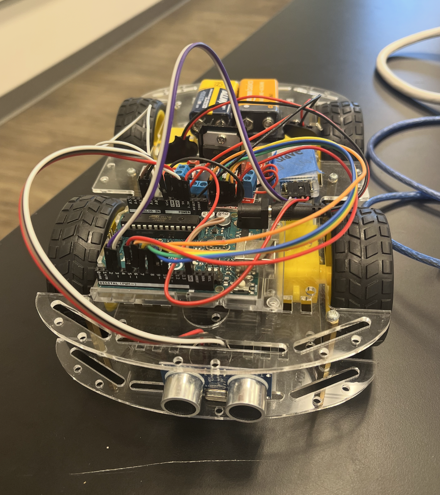
  <br>
  <small>figure 11: robot with sensor </small>
</p>
<p align="center">
  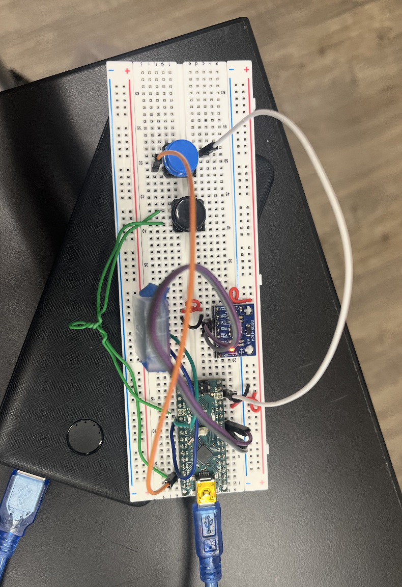
  <br>
  <small>figure 12: controller with buttons </small>
</p>

## Next Step
A modification I would've added if I had more time was a voice controlled option, so that the robot would do whatever gesture was dictated.

# Final Milestone

<iframe width="560" height="315" src="https://www.youtube.com/embed/PHOumUvl-Y8?si=3Ckai170BCbswP4G" title="YouTube video player" frameborder="0" allow="accelerometer; autoplay; clipboard-write; encrypted-media; gyroscope; picture-in-picture; web-share" referrerpolicy="strict-origin-when-cross-origin" allowfullscreen></iframe>

## Description

For my third milestone, I had the two components work together. The first step was to make sure the bluetooth works, which I had done in the previous milestone. Then, I tested my accelerometer to make sure it works properly. The rest was primarily in the code, which I have 2 sets of, one for the robot (refer to "Final Robot Code"), and one for the controller (refer to "Final Controller Code"). One of the most importants features for the controller code are for the accelerometer. The code for the accelerometer sets conditions so that if the angle at which the accelerometer is at is greater than a certain value, it is considered going a certain direction depending on which axis. It then sends a short message to the robot through bluetooth. The code for the robot includes codes that set the speed and commands to set the direction. Based on the commands received from the HC-05, the robot would go in the direction given from the controller. The speed, on the other hand, is set and is not changed by the accelerometer. After uploading the code, I was able to use the serial monitor to see what data was being received.

## How it works

**MPU6050:**
For the hand controller, a key component is the MPU6050, which I have also referred to as the accelerometer. The MPU6050 has four main components, the gyroscope, accelerometer, temperature sensor, and digital motion processor, and is capable of measuring an object's acceleration, temperature, and angular velocity. In my project, its primary use is measure the angle at which it is being held at. This is extremely important because my robot is controlled by gestures. The accelerometer works by detecting the force that is being put on the object. My code allows this data to be converted to a single letter of the following: f (forward), b (backward), r (right), l(left), or s(stop). This information is then sent to the robot through the HC-05, and the robot interprets the letter and decides which direction to go.

<p align="center">
  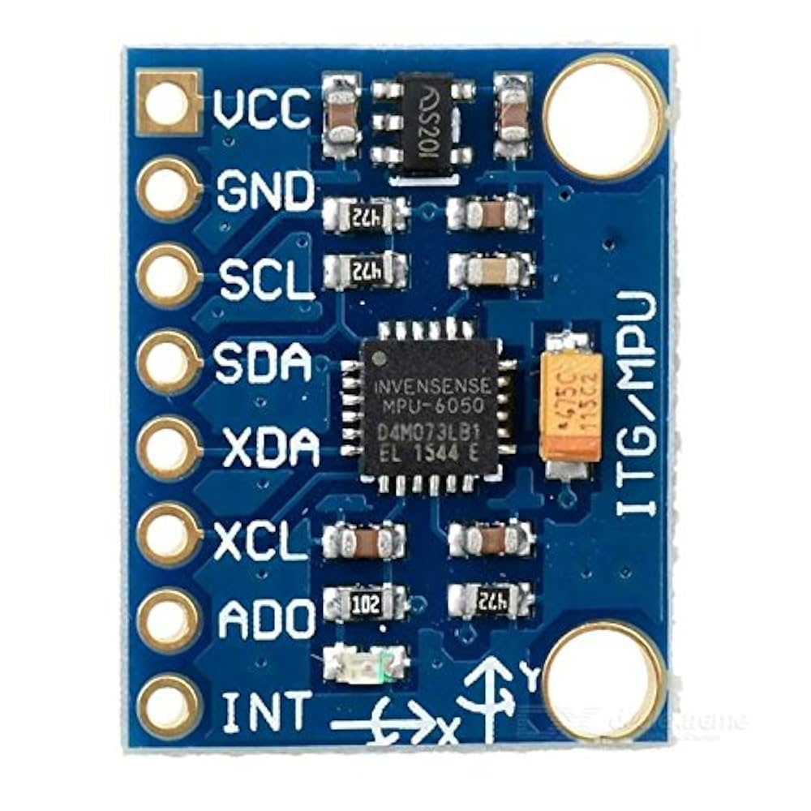
  <br>
  <small>figure 10: an accelerometer with 8 pins </small>
</p>


## Challenges

**MPU6050:**
I faced an issue with the accelerometer showing 127 on all three axes, which was inaccurate. This means the data was not being recieved by the Arduino, meaning wiring was wrong. I fixed this by first switching out the accelerometer, which didn't work. Therefore, I switched the wiring so that SDA pin would connect to SCL pin of Arduino, not SDA. This is important because the SCL pin is the Serial Clock Line, and it tells Arduino it is ready to send data. On the other hand, the SDA is Serial Data Line, and it sends data. Wiring is important because the SCL pin has to communicate that it is ready to send data before the SDA pin sends it over. This fixed the issue.

**Code:**
I firsted changed the code to not include flags, which can be set to 1 and 0. This was unnecessary, so I removed it. This didn't solve the problem, though, so I decided to debug it using the serial monitor. By adding a line that says "Serial.println('xy')," I was able to see what data was going through and which caused the problem. I first did this for the controller. I set the serial communication rate to 9600 bps, and the commands printed in the serial monitor, showing data from the accelerometer was going through. Then, I observed the serial monitor in the code for the robot, which was empty. Therefore, I changed the code slightly (by changing BT_Serial to Serial) so that the robot is controlled manually through the serial monitor, instead of through the bluetooth connection. I found that throughout my base project, the serial monitor was the easiest way to debug.

**Battery:**
I discovered that my controller only worked while plugged in to my laptop, not with the 9V battery. I reasoned that this would be because the current is higher with my laptop. Therefore, I used a powerbank to power the hand controller for the remainder of the project. As for the robot, I realized that I had to replace my AA batteries many times. Therefore I decided to use a 9V battery so I wouldn't have to continiously replace the batteries. In my milestone video, I only used one 9V battery, but, afterwards, I powered the Arduino and the motor driver with seperate 9V batteries to prevent the motor driver from draining all of the battery.

## Next Step
For the next milestone, I will be adding my modifications, which are a circle gesture, option to repeat previous gestures, ultrasonic sensor for collision prevention, and speed control.

## Images

The images show the final adjustments I made for my base project. I changed the batteries on each component, as the controller is now powered by a battery pack and the robot is powered by a 9V battery.

<p align="center">
  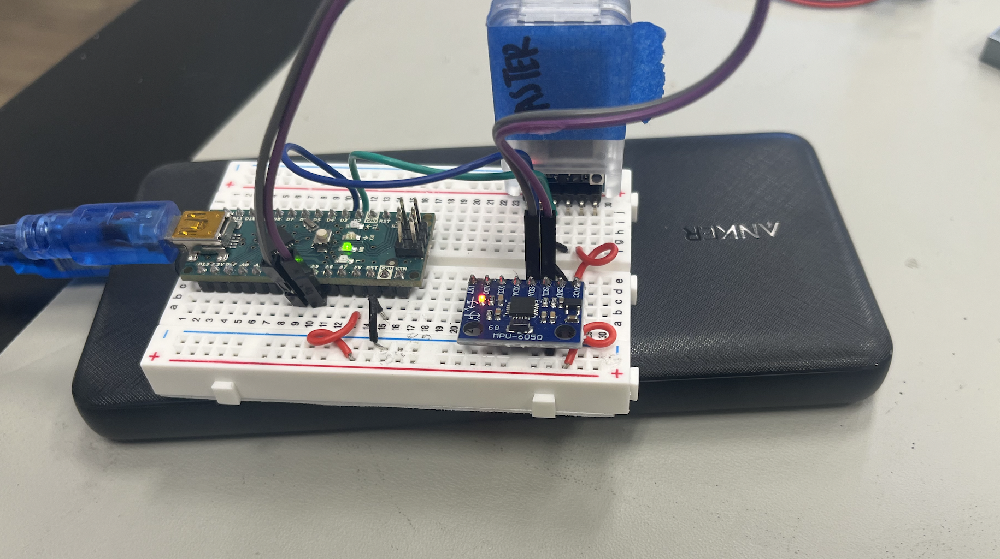
  <br>
  <small>figure 8: milestone 3 controller</small>
</p>

<p align="center">
  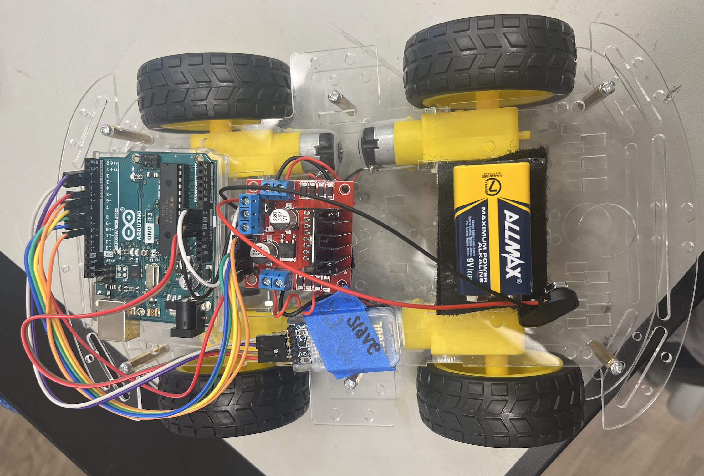 
  <br>
  <small>figure 9: milestone 3 robot</small>
</p>


# Second Milestone

<iframe width="560" height="315" src="https://www.youtube.com/embed/JsxYq6JUvng?si=LoC-VAoXQ2ImqSWc" title="YouTube video player" frameborder="0" allow="accelerometer; autoplay; clipboard-write; encrypted-media; gyroscope; picture-in-picture; web-share" referrerpolicy="strict-origin-when-cross-origin" allowfullscreen></iframe>

## Description

For my second milestone, I built the hand controller of the robot and tested each component individually. The hand controller includes and Arduino Nano, HC-05 bluetooth module, and an accelerometer. The first step was put the Arduino Nano, accelerometer, and HC-05 in place. Then, I attached the battery with male header pins. Finally, I attached everything with hard jump wires and male to male jumper wires. On the robot controller, only the TX and RX pin on the HC-05 should be connected to the 2 and 3 (RX and TX) pins on the Arduino Nano (refer to figure 1 for how it is wired). The SCL pin on the accelerometer should be connected to the A4 pin, and the SDA pin should be connected to A5. The next steps were to connect the two bluetooth modules and upload the code. While doing this, I made sure that the EN pin is connected to the 3.3V on the Arduino. I was able to pair the modules by first plugging the Arduinos to my laptop, then plugging the HC-05 into the Arduino. Then, I proceeded to open the Serial Monitor in Arduino IDE and send commands to assign each module as either the slave or master. A few commands include AT, which checks that the HC-05 is responsive, AT+ROLE, which assigns the HC-05 a role, AT+CMODE, which allows the master to bind to either any or one specific HC-05, and AT+BIND, which is used to bind the master to the slave. Once they were paired, I unplugged the EN pin. I knew they were paired because the tiny light on the modules would blink in sync if connected, would blink slowly while in AT mode, and blinks quickly if it isn't paired or in AT mode. For the code, I used 3 seperate sets, which were all written in C++. The first one was very simple and a test to see that the Arduino boards were responsive. It allowed the light on the board to blink on and off when requested (refer to "Blink Test" code). The second code was to pair the HC-05s (refer to "AT Mode Code"). It was also simple with code that set the RX and TX pins to 2 and 3. Because it was simple, I could isolate the issue to the two bluetooth modules instead of my code. Finally, the last code was to test the car and have it drive back and forth (refer to "Robot Testing Code").

## How it works

**Motor Driver:**
One of the key components of this milestone is the motor driver. It works with having the motors connected to its pins, which are screwed in. For the motor driver, polarity decides which direction is forward and backword. It is also able to switch directions without re-wiring through the H-Bridge. The H-Bridge allows the motor driver to control the direction of the DC motors by, in a way, acting as a "bridge" between the power source, which is either the battery or laptop, to the motor. The motor driver has 6 pins, each of which has a seperate function. The pins are the ENA pin (left side speed), IN1 (left side direction), IN2 (backward/forward on left side), ENB (right side speed), IN3 (right side direction), and IN4 (right side backward/forward) (refer to figure 7 below).

<p align="center">
  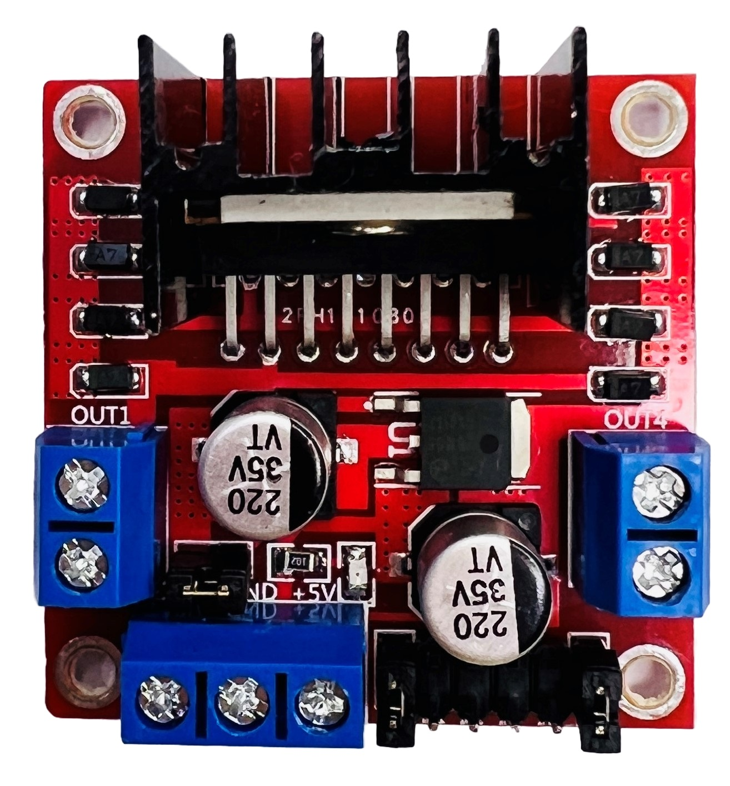
  <br>
  <small>figure 7: a motor driver with 6 pins and an h bridge</small>
</p>

**HC-05s:**
The HC-05s work by, as said earlier, setting a master and slave module. Once they are bound together, the HC-05 promptly sends messages between the two modules. 

<p align="center">
    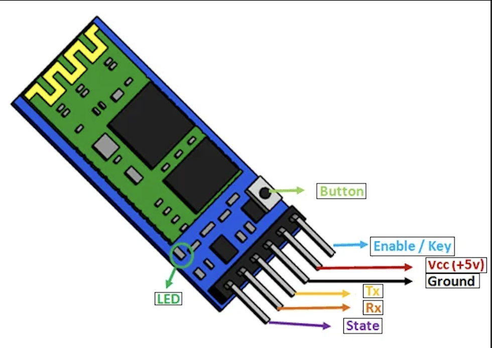
    <br>
    <small>figure 6: a bluetooth module with an led and 6 pins: EN, 5V, Gnd, Tx, Rx, and state </small>
</p>


## Challenges

**Powering Controller and body:**
The first challenge I faced was when first powering on the controller and body. The first batteries I was using were 1.2 V batteries, which I used 4 of. This totalled to 4.8 V, which was enough to power my motor driver and Arduino Uno, but not the HC-05. I isolated the issue by using a multimeter to measure how much power was given to the HC-05 when the Arduino Uno was plugged in to  my laptop, which powered on the HC-05. The multimeter showed around 6.5 volts, which was much more than the 4.8 that I was given. I decided to switch the batteries to 1.5 V AA batteries which totalled to 6V. While this wasn't as much power as my computer, it was still enough to allow the HC-05 to power on. 

**Pairing HC-05s:**
The second challenge I faced was when pairing the two HC-05. This was my biggest challenge in the project so far, as it took me a while to figure out. The first issue I faced when sending AT commands. At first, it was unresponsive because the serial baud rate was less than it needed to be. I thought it was because the Arduino Uno prefered 5V, while the bluetooth module prefered 3.3V. I was going to use resistors, but I decided against it because it turned out to be unnecessary. I found out it was the baud rate that was the issue, and, after fixing that, I was able to send the AT commands. That was when I faced my second issue, which was the two modules not pairing together. The commands were correct, so I decided to redo my wiring to make sure it was correct. I found out that the RX and TX pins were swapped. This is important because the RX pin is responsible for recieving, while the TX pin is responsible for transmitting. Therefore, if both pins are transmitting, there will be an error. Fixing this solved the issue.

**Re-Soldering wires:**
The third challenge I faced was while working on pairing the two modules, the previously soldered wires connecting the Arduino Nano to the battery fell apart. I had to resolder this later in the project. 

**Uploading Code:**
The first issue with uploading was with the processor. I had set the processor on my laptop when uploading my code was the ATmega328P (Old Bootloader). After playing around with the settings, I found out that the processor for the Arduino Nano was suppposed to be set to ATmega328P. The second issue I faced while uploading the code was that my 0 and 1 pins on the Arduino were occupied. This resulted in a problem because the 0 and 1 pins, otherwise known as the pins set to be TX and RX, are used when recieving and transmitting code. To solve it, I rewired the 0 and 1 pins to be 2 and 3 and used the SoftwareSerial library set my RX and TX pins to 2 and 3 (refer to Robot Code and Controller Code). 

**DC Motors:**
For a while, only one side was working. I used a multimeter and found that 0V were reaching the motors on that side. I fixed this by resoldering everything on that side. There was also an inconsistency, which I found was because the motors had to be operated by the battery because of my connections.

## Next Step

For the next milestone, I will be adding my sending my code and having the robot and controller work together.

## Image

The images below show the updates I made for milestone 2. The controller was new to the milestone, and it is powered by a 9V battery (refer to Controller Schematics for details on controller). I also added the wheels to the car.

<p align="center">
  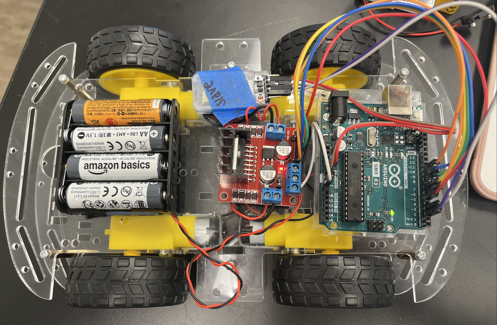
  <br>
  <small>figure 4: milestone 2 robot</small>
</p>

<p align="center">
  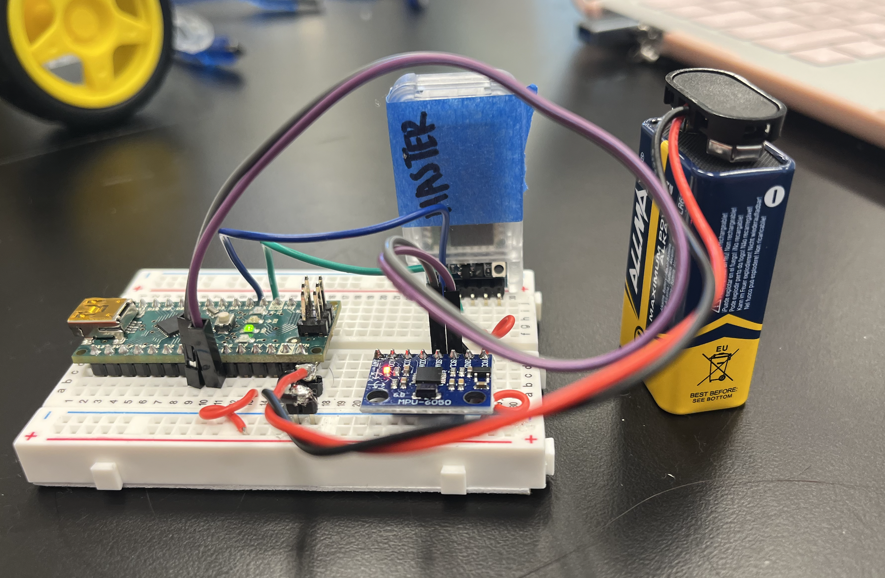
  <br>
  <small>figure 5: milestone 2 controller</small>
</p>


# First Milestone

<!--**Don't forget to replace the text below with the embedding for your milestone video. Go to Youtube, click Share -> Embed, and copy and paste the code to replace what's below.**-->
<!---youtube video below -->
<iframe width="560" height="315" src="https://www.youtube.com/embed/_bARJUOrQyM?si=nMIZuDmcr8LgFZNh" title="YouTube video player" frameborder="0" allow="accelerometer; autoplay; clipboard-write; encrypted-media; gyroscope; picture-in-picture; web-share" referrerpolicy="strict-origin-when-cross-origin" allowfullscreen></iframe>

## Description

For my first milestone, I built the base of the robot. It includes 4 DC motors, a drive motor, 4 AAA batteries, and an Arduino Uno. The first step was to secure the DC motors and add a wheel to them. Then, I soldered wires to them which connected to the motor driver. Finally, I attached the battery case to the motor driver and the Arduino Uno to the motor driver with male to female wires. One of the most important things I had to do in Milestone 1 was being careful with the wire connections. On the robot body, the VCC on the HC-05 should be connected to the 5V on the Arduino Uno, the two ground pins should be connected, the TX pin should be connected to the RX pin, and vice versa. The ENA, IN1, IN2, IN3, IN4, and ENB pins on the motor driver should be connected to the D10, D9, D8, D7, D6, and D5 pins on the Arduino Uno. On the robot controller, only the TX and RX pin on the HC-05 should be connected to the RX and TX pins on the Arduino Nano. The SCL pin on the accelerometer should be connected to the A4 pin, and the SDA pin should be connected to A5.

## Challenges

**Attaching wheel to DC motors:**
The first challenge I faced was when attaching the wheel to the DC motors. One of them would not stay, so I solved the issue by adding electrical tape to secure it. 

**Soldering wires to motors:**
The second issue I faced was with soldering the wires to the motors. It was important to be careful when doing that because the soldering iron melted the plastic multiple times. 

**Soldering wires to motor driver:**
The final issue I faced was when soldering the wires to each other to connect to the motor driver. Because they were supposed to be screwed in, it was difficult to control the amount of solder on the wires as to be sure that they can still be screwed in. I had to remove solder multiple times.

## Next Step

For the next milestone, I will be creating the controller and testing to see that each component works individually.

## Image

This is an image of what I achieved in this milestone (refer to Robot Schematics for more details). In the image, you can see that the hardware of the robot is built, but I have not yet attached the wheels. 
<p align="center">
  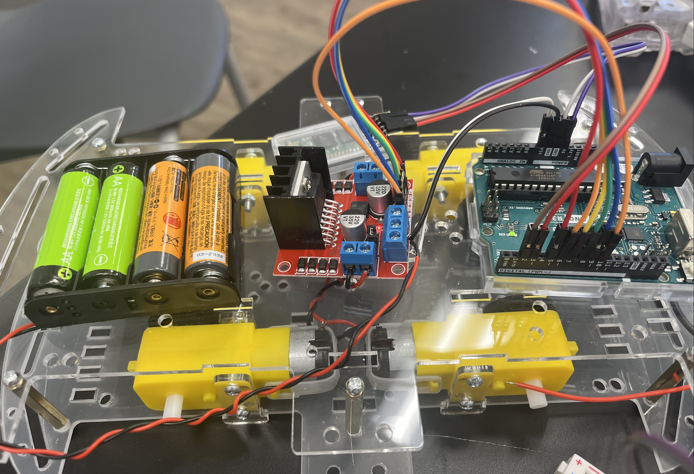
  <br>
  <small>figure 3: milestone 1 robot</small>
</p>

# Starter Project Milestone

<!--**Don't forget to replace the text below with the embedding for your milestone video. Go to Youtube, click Share -> Embed, and copy and paste the code to replace what's below.**-->
<!---youtube video below -->
<iframe width="560" height="315" src="https://www.youtube.com/embed/hjAuse6q-Nc?si=5vD7hXNev6jRxSgg" title="YouTube video player" frameborder="0" allow="accelerometer; autoplay; clipboard-write; encrypted-media; gyroscope; picture-in-picture; web-share" referrerpolicy="strict-origin-when-cross-origin" allowfullscreen></iframe>


**Description:**
My starter project was a retro arcade game console, which was a way to practice soldering both pins and wires. The project includes several displays, buttons, and wires. The first step for the starter project was soldering each of the displays and buttons on to the board. The next step was to solder the wires that were connected to the battery case to the board. The last step was to assemble the case and screw everything in.

**Challenges:**
The first challenge I faced was soldering the pins. Because they were so close together, it was important to be careful to not solder other pins. The second challenge I faced was soldering the wires. This was was a problem for me because I found it was difficult to keep them in place. To solve this issue, I first tried bending them to stay in place, which did not work, so I ended up using eletrical tape to hold them in place. Another issue I faced when soldering the wires was burning some of them. I fixed this by stripping more of the wire and being sure not to hold the soldering iron to them to long. The last challenge I faced was screwing in the case. I used the wrong screws multiple times, which I fixed after trial and error and looking at other students' projects.

**Next Step:**
Using the things I learned in the starter project, I would start working on my intensive project.


<!--For your first milestone, describe what your project is and how you plan to build it. You can include:
- An explanation about the different components of your project and how they will all integrate together
- Technical progress you've made so far
- Challenges you're facing and solving in your future milestones
- What your plan is to complete your project-->

# Schematics 
Here is the digital version of the schematics of my controller. The small blue rectangle is the MPU6050, the long rectangle in the upper middle is the Arduino Nano, and the rectangle sticking out is the HC05. There is a black button for my modification. It is powered by the battery pack.

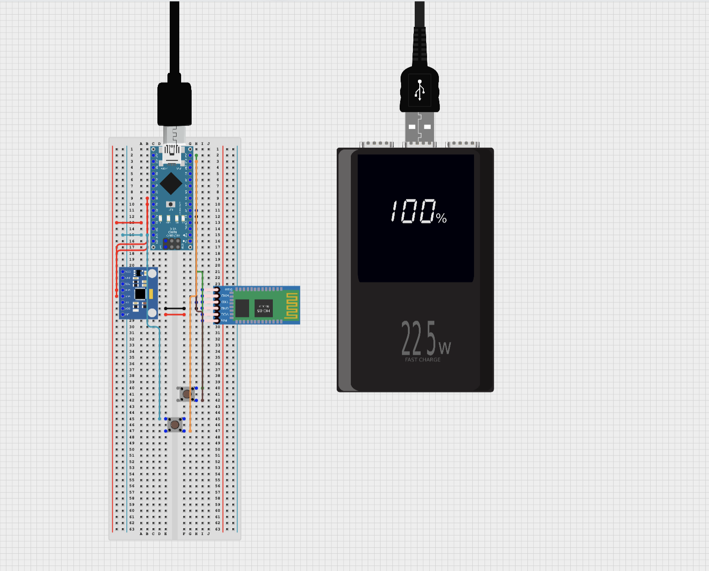
figure 1

Here is the digital version of the schematics of my robot. There are 4 DC motors, the red motor driver, small HC-05, and the Arduinio Uno. It is powered by a 9V battery.
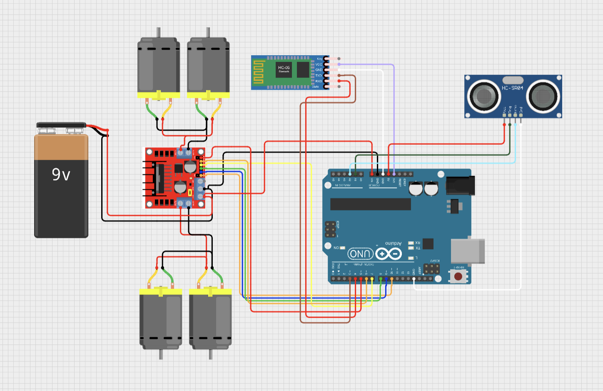
figure 2
<!--Tinkercad](https://www.tinkercad.com/blog/official-guide-to-tinkercad-circuits) and [Fritzing](https://fritzing.org/learning/) are both great resoruces to create professional schematic diagrams, though BSE recommends Tinkercad becuase it can be done easily and for free in the browser.-->

# Code
<!--Here's where you'll put your code. The syntax below places it into a block of code. Follow the guide [here]([url](https://www.markdownguide.org/extended-syntax/)) to learn how to customize it to your project needs. -->
## Milestone 2 code
### Blink Test 

This test was used to check that the Arduinos are working
```c++
void setup() {
  // initialize digital pin LED_BUILTIN as an output.
  pinMode(LED_BUILTIN, OUTPUT);
}

// the loop function repeats the light turning on and off until turned off
void loop() {
  digitalWrite(LED_BUILTIN, HIGH);  // turn the LED on (HIGH is the voltage level)
  delay(1000);                      // wait for a second
  digitalWrite(LED_BUILTIN, LOW);   // turn the LED off by making the voltage LOW
  delay(1000);                      // wait for a second
}
```
### AT Mode Code 

This was the code used while in AT mode.
```c++
#include <SoftwareSerial.h> //built in library to customize RX and TX pins
SoftwareSerial BTserial(2, 3); // RX = 2, TX = 3

void setup() {
 Serial.begin(9600);       // Serial Monitor baud rate
 BTserial.begin(38400);    // HC-05 AT mode baud rate
 Serial.println("Ready to send AT commands");
}

void loop() {
 if (BTserial.available()) Serial.write(BTserial.read());
 if (Serial.available()) BTserial.write(Serial.read());
}

```
### Robot Testing Code

This is the code I used to test the robot motor driver and motors to make sure they work and are synced in the right direction.
```c++
// ----- Pin assignments -----
const int ENA = 10;   // left-side speed (PWM)
const int IN1 = 9;    // left-side direction
const int IN2 = 8;

const int ENB = 5;    // right-side speed (PWM)
const int IN3 = 7;    // right-side direction
const int IN4 = 6;

// ----- Setup runs once -----
void setup() {
  // Direction pins
  pinMode(IN1, OUTPUT);
  pinMode(IN2, OUTPUT);
  pinMode(IN3, OUTPUT);
  pinMode(IN4, OUTPUT);

  // Enable (speed) pins
  pinMode(ENA, OUTPUT);
  pinMode(ENB, OUTPUT);

 
}

void loop() {
   // ----- Move forward -----
  digitalWrite(IN1, HIGH);   // left wheel forward
  digitalWrite(IN2, LOW);
  digitalWrite(IN3, HIGH);   // right wheel forward
  digitalWrite(IN4, LOW);

  analogWrite(ENA, 255);     // full speed (0-255)
  analogWrite(ENB, 255);

  delay(2000);               // drive 2 s

  // ----- Stop -----
  digitalWrite(IN1, LOW);
  digitalWrite(IN2, LOW);
  digitalWrite(IN3, LOW);
  digitalWrite(IN4, LOW);

  analogWrite(ENA, 0);       // motors off
  analogWrite(ENB, 0);
 
}
```
## Milestone 3 code

### Accelerometer and Gyroscope Testing Code 

This is the code I used to test that the Accelerometer is able to read basic information given. 
Here is the code of my robot.
```c++
// Basic demo for accelerometer readings from Adafruit MPU6050

#include <Adafruit_MPU6050.h>
#include <Adafruit_Sensor.h>
#include <Wire.h>

Adafruit_MPU6050 mpu;

void setup(void) {
  Serial.begin(115200);
  while (!Serial)
    delay(10); // will pause Zero, Leonardo, etc until serial console opens

  Serial.println("Adafruit MPU6050 test!");

  // Try to initialize!
  if (!mpu.begin()) {
    Serial.println("Failed to find MPU6050 chip");
    while (1) {
      delay(10);
    }
  }
  Serial.println("MPU6050 Found!");

  mpu.setAccelerometerRange(MPU6050_RANGE_8_G);
  Serial.print("Accelerometer range set to: ");
  switch (mpu.getAccelerometerRange()) {
  case MPU6050_RANGE_2_G:
    Serial.println("+-2G");
    break;
  case MPU6050_RANGE_4_G:
    Serial.println("+-4G");
    break;
  case MPU6050_RANGE_8_G:
    Serial.println("+-8G");
    break;
  case MPU6050_RANGE_16_G:
    Serial.println("+-16G");
    break;
  }
  mpu.setGyroRange(MPU6050_RANGE_500_DEG);
  Serial.print("Gyro range set to: ");
  switch (mpu.getGyroRange()) {
  case MPU6050_RANGE_250_DEG:
    Serial.println("+- 250 deg/s");
    break;
  case MPU6050_RANGE_500_DEG:
    Serial.println("+- 500 deg/s");
    break;
  case MPU6050_RANGE_1000_DEG:
    Serial.println("+- 1000 deg/s");
    break;
  case MPU6050_RANGE_2000_DEG:
    Serial.println("+- 2000 deg/s");
    break;
  }

  mpu.setFilterBandwidth(MPU6050_BAND_21_HZ);
  Serial.print("Filter bandwidth set to: ");
  switch (mpu.getFilterBandwidth()) {
  case MPU6050_BAND_260_HZ:
    Serial.println("260 Hz");
    break;
  case MPU6050_BAND_184_HZ:
    Serial.println("184 Hz");
    break;
  case MPU6050_BAND_94_HZ:
    Serial.println("94 Hz");
    break;
  case MPU6050_BAND_44_HZ:
    Serial.println("44 Hz");
    break;
  case MPU6050_BAND_21_HZ:
    Serial.println("21 Hz");
    break;
  case MPU6050_BAND_10_HZ:
    Serial.println("10 Hz");
    break;
  case MPU6050_BAND_5_HZ:
    Serial.println("5 Hz");
    break;
  }

  Serial.println("");
  delay(100);
}

void loop() {

  /* Get new sensor events with the readings */
  sensors_event_t a, g, temp;
  mpu.getEvent(&a, &g, &temp);

  /* Print out the values */
  Serial.print("Acceleration X: ");
  Serial.print(a.acceleration.x);
  Serial.print(", Y: ");
  Serial.print(a.acceleration.y);
  Serial.print(", Z: ");
  Serial.print(a.acceleration.z);
  Serial.println(" m/s^2");

  Serial.print("Rotation X: ");
  Serial.print(g.gyro.x);
  Serial.print(", Y: ");
  Serial.print(g.gyro.y);
  Serial.print(", Z: ");
  Serial.print(g.gyro.z);
  Serial.println(" rad/s");

  Serial.print("Temperature: ");
  Serial.print(temp.temperature);
  Serial.println(" degC");

  Serial.println("");
  delay(500);
}
```

## Robot Code

This is my final milestone's code for the robot. 
```c++
#include <SoftwareSerial.h>
SoftwareSerial BT_Serial(2, 3); // RX, TX


#define enA 10//Enable1 L298 Pin enA
#define in1 9 //Motor1  L298 Pin in1
#define in2 8 //Motor1  L298 Pin in1
#define in3 7 //Motor2  L298 Pin in1
#define in4 6 //Motor2  L298 Pin in1
#define enB 5 //Enable2 L298 Pin enB


char bt_data; // variable to receive data from the serial port
int Speed = 150; //Write The Duty Cycle 0 to 255 Enable Pins for Motor Speed


void setup() { // put your setup code here, to run once


Serial.begin(9600); // start serial communication at 9600bps
BT_Serial.begin(38400);


pinMode(enA, OUTPUT); // declare as output for L298 Pin enA
pinMode(in1, OUTPUT); // declare as output for L298 Pin in1
pinMode(in2, OUTPUT); // declare as output for L298 Pin in2
pinMode(in3, OUTPUT); // declare as output for L298 Pin in3 
pinMode(in4, OUTPUT); // declare as output for L298 Pin in4
pinMode(enB, OUTPUT); // declare as output for L298 Pin enB


delay(200);
}
void loop(){
if(BT_Serial.available() > 0){  //if some date is sent, reads it and saves in state   
bt_data = BT_Serial.read();
Serial.println(bt_data);        
}
if(bt_data == 'f'){
    forward();
    Speed=180;// if the bt_data is 'f' the DC motor will go forward
    Serial.println('f');
    }
else if(bt_data == 'b'){
    backward();
    Speed=180; // if the bt_data is 'b' the motor will go backward
    Serial.println('b');
    }
else if(bt_data == 'l'){
    turnLeft();
    Speed=250; // if the bt_data is 'l' the motor will turn left
    Serial.println('l');
    }
else if(bt_data == 'r'){
    turnRight();
    Speed=250; // if the bt_data is 'r' the motor will turn right
    Serial.println('r');
    }
else if(bt_data == 's'){
    Stop();  // if the bt_data 's' the motor will Stop
    Serial.println('s');
    } 


analogWrite(enA, Speed); // Write The Duty Cycle 0 to 255 Enable Pin A for Motor1 Speed
analogWrite(enB, Speed); // Write The Duty Cycle 0 to 255 Enable Pin B for Motor2 Speed


delay(50);
}


void forward(){  //forward
digitalWrite(in1, HIGH); //Right Motor forward Pin
digitalWrite(in2, LOW);  //Right Motor backward Pin
digitalWrite(in3, LOW);  //Left Motor backward Pin
digitalWrite(in4, HIGH); //Left Motor forward Pin
}


void backward(){ //backward
digitalWrite(in1, LOW);  //Right Motor forward Pin
digitalWrite(in2, HIGH); //Right Motor backward Pin
digitalWrite(in3, HIGH); //Left Motor backward Pin
digitalWrite(in4, LOW);  //Left Motor forward Pin
}


void turnRight(){ //turnRight
digitalWrite(in1, LOW);  //Right Motor forward Pin
digitalWrite(in2, HIGH); //Right Motor backward Pin
digitalWrite(in3, LOW);  //Left Motor backward Pin
digitalWrite(in4, HIGH); //Left Motor forward Pin
}


void turnLeft(){ //turnLeft
digitalWrite(in1, HIGH); //Right Motor forward Pin
digitalWrite(in2, LOW);  //Right Motor backward Pin
digitalWrite(in3, HIGH); //Left Motor backward Pin
digitalWrite(in4, LOW);  //Left Motor forward Pin
}


void Stop(){ //stop
digitalWrite(in1, LOW); //Right Motor forward Pin
digitalWrite(in2, LOW); //Right Motor backward Pin
digitalWrite(in3, LOW); //Left Motor backward Pin
digitalWrite(in4, LOW); //Left Motor forward Pin
}

}


```
## Controller Code

This is the final code for my hand controller.
```c++
#include <SoftwareSerial.h>
SoftwareSerial BT_Serial(2, 3); // RX, TX

#include <Wire.h> // I2C communication library

const int MPU = 0x68; // I2C address of the MPU6050 accelerometer
int16_t AcX, AcY, AcZ;

int flag=0;

void setup () {// put your setup code here, to run once

Serial.begin(9600); // start serial communication at 9600bps
BT_Serial.begin(38400); 

// Initialize interface to the MPU6050
Wire.begin();
Wire.beginTransmission(MPU);
Wire.write(0x6B);
Wire.write(0);
Wire.endTransmission(true);

delay(500); 
}

void loop () {
Read_accelerometer(); // Read MPU6050 accelerometer

if(AcX<60 ){
      //flag=1;
      BT_Serial.write('f');
      Serial.println('f');
      }
if(AcX>130){
     // flag=1; 
      BT_Serial.write('b');
      Serial.println('b');}
      
if(AcY<60){
     // flag=1; 
      BT_Serial.write('l'); 
      Serial.println('l');
      }
if(AcY>130){
     // flag=1; 
      BT_Serial.write('r');
      Serial.println('r');
      }
  
if((AcX>70)&&(AcX<120)&&(AcY>70)&&(AcY<120)){
      flag=0;
BT_Serial.write('s');
Serial.println('s');
}

delay(100);  
}

void Read_accelerometer(){
      // Read the accelerometer data
Wire.beginTransmission(MPU);
Wire.write(0x3B); // Start with register 0x3B (ACCEL_XOUT_H)
Wire.endTransmission(false);
Wire.requestFrom(MPU, 6, true); // Read 6 registers total, each axis value is stored in 2 registers

AcX = Wire.read() << 8 | Wire.read(); // X-axis value
AcY = Wire.read() << 8 | Wire.read(); // Y-axis value
AcZ = Wire.read() << 8 | Wire.read(); // Z-axis value

AcX = map(AcX, -17000, 17000, 0, 180);
AcY = map(AcY, -17000, 17000, 0, 180);
AcZ = map(AcZ, -17000, 17000, 0, 180);

Serial.print(AcX);
Serial.print("\t");
Serial.print(AcY);
Serial.print("\t");
Serial.println(AcZ); 
}
```
## Modification Milestone code
### Final controller code with modifications
```c++
#include <SoftwareSerial.h>
SoftwareSerial BT_Serial(2, 3); // RX, TX

#include <Wire.h> // I2C communication library
const int buttonPin = 12; //button pin: A12
int buttonstate = 0; 
int count = 0; //count starts at 0
const int circlebutton = 11; //circlebutton: A11
int buttonState = 0;
bool circle; //sets circle as a booelan that can be true or false
// int start;
char curr;
char prev;
char buf[5]; //sets number of characters in buffer

const int MPU = 0x68; // I2C address of the MPU6050 accelerometer
int16_t AcX, AcY, AcZ; 
bool memOn; //sets memOn as a boolean that can be true or false

int flag=0;
void setup () {// put your setup code here, to run once

Serial.begin(9600); // start serial communication at 9600bps
BT_Serial.begin(38400);


// Initialize interface to the MPU6050
Wire.begin();
Wire.beginTransmission(MPU);
Wire.write(0x6B);
Wire.write(0);
Wire.endTransmission(true);
pinMode(buttonPin, INPUT_PULLUP); //define button as input
pinMode(circlebutton, INPUT_PULLUP); //define button as input
delay(500);
}


void loop (){
    Read_accelerometer(); // Read MPU6050 accelerometer
    buttonstate = digitalRead(buttonPin); //initialize memory button
    memOn = false; //memOn is false when the code is first run
    buttonState = digitalRead(circlebutton); //initialize circle button
    circle = false; //circle is false when the code is first run
    
    if(buttonstate == LOW){ //if button is pressed:
        memOn = !memOn; //turn memOn to the state it is not (false--> true, true--> false)
        while (digitalRead(buttonPin) == LOW){
          delay(200); //wait for the button to be not pressed
        }
    }
    if(buttonState == LOW){ //if button is pressed
        circle = !circle; //turn circle to state it is not
        while (digitalRead(circlebutton) == LOW){
          delay(200); //wait for button to be not pressed
        }
    }
    if(circle){ //if circle is true (button was pressed)
      BT_Serial.write('c'); //send circle to robot
      Serial.println('c'); //print circle in serial monitor
      delay(2000); //wait 2s
    }
    if(circle == false){
    if(memOn == false){ //if mem is off (Standard)
        if((AcX<75)&&(AcX>40)&&(AcY>75)&&(AcY<110)){ //forward slow
            //flag=1;
            BT_Serial.write('f'); //send forward to robot
            Serial.println('f'); //print forward in serial monitor
            curr = 'f'; //set current in buffer as forward slow
        }
        if((AcX<40)&&(AcY>75)&&(AcY<110)){ //Forward fast
            //flag=1;
            BT_Serial.write('F'); //send Forward to robot
            Serial.println('F');//print Forward in serial monitor
            curr = 'f'; //set current is buffer as forward fast
        }
        if((AcX>110)&&(AcX<145)&&(AcY>75)&&(AcY<110)){ //backward slow
            // flag=1;
            BT_Serial.write('b'); //send backward to robot
            Serial.println('b');
            curr = 'b'; //set current is buffer as backward slow
        }
        if((AcX>145)&&(AcY>75)&&(AcY<110)){ //Backward fast
            // flag=1;
            BT_Serial.write('B');//send Backward to robot
            Serial.println('B');
            curr = 'b'; //set current is buffer as backward fast
        }
        if((AcY<75)&&(AcY>40)){ //left slow
            // flag=1;
            BT_Serial.write('l');//send left to robot
            Serial.println('l');
            curr = 'l'; //set current is buffer as left slow
        }
        if((AcY<40)&&(AcX>75)&&(AcX<110)){ //Left fast
            // flag=1;
            BT_Serial.write('L');//send left to robot
            Serial.println('L');
            curr = 'l'; //set current is buffer as left fast
        }
        if((AcY>110)&&(AcY<145)&&(AcX>75)&&(AcX<110)){ //right slow
            // flag=1;
            BT_Serial.write('r');//send right to robot
            Serial.println('r');
            curr = 'r'; //set current is buffer as right slow
        }
        if((AcY>145)&&(AcX>75)&&(AcX<110)){ //Right fast
            // flag=1;
            BT_Serial.write('R');//send Right to robot
            Serial.println('R');
            curr = 'r'; //set current is buffer as right fast
        }
        if((AcX>70)&&(AcX<120)&&(AcY>70)&&(AcY<120)){ //stop
            //flag=0;
            BT_Serial.write('s');//send stop to robot
            Serial.println('s'); //no update so that the repeating doesn't repeat stop
        }
    }
    if((curr!=prev)&&(curr!='\n')){ //update buffer
        buf[count]=curr; //latest character in buffer is the current one
        count=(count+1)%5;
    }
    prev=curr; //current becomes previous to open space for new character
    if(memOn){
        for(int i = 0; i<4; i++){ //run for each character
          if (buf[(count+1+i)%5] == 'f'){//if any character is f
            BT_Serial.write('f'); //go f
          }
          if (buf[(count+1+i)%5] == 'b'){//if any character is b
            BT_Serial.write('b');//go b
          }
          if (buf[(count+1+i)%5] == 'r'){//if any character is r
            BT_Serial.write('r');//go f
          }
          if (buf[(count+1+i)%5] == 'l'){//if any character is l
            BT_Serial.write('l');//go l
          }
          delay(700);//play for 7 milliseconds
        } 
    }
    }
    delay(100);
}
void Read_accelerometer(){
    // Read the accelerometer data
    Wire.beginTransmission(MPU);
    Wire.write(0x3B); // Start with register 0x3B (ACCEL_XOUT_H)
    Wire.endTransmission(false);
    Wire.requestFrom(MPU, 6, true); // Read 6 registers total, each axis value is stored in 2 registers
    AcX = Wire.read() << 8 | Wire.read(); // X-axis value
    AcY = Wire.read() << 8 | Wire.read(); // Y-axis value
    AcZ = Wire.read() << 8 | Wire.read(); // Z-axis value
    AcX = map(AcX, -17000, 17000, 0, 180);
    AcY = map(AcY, -17000, 17000, 0, 180);
    AcZ = map(AcZ, -17000, 17000, 0, 180);
}


```

### Final robot code with modifications

```c++
#include <SoftwareSerial.h>
SoftwareSerial BT_Serial(2, 3); // RX, TX

#define enA 10//Enable1 L298 Pin enA
#define in1 9 //Motor1  L298 Pin in1
#define in2 8 //Motor1  L298 Pin in1
#define in3 7 //Motor2  L298 Pin in1
#define in4 6 //Motor2  L298 Pin in1
#define enB 5 //Enable2 L298 Pin enB

const int echoPin = A2;//echoPin HC-SR04 Pin A2
const int trigPin = A1;//trigPin HC-SR04 Pin A1
int count = 0;
int start;
char curr;
char prev;
char buf[3];
bool iscircle;
float timing = 0.0;
float distance = 0.0;

char bt_data; // variable to receive data from the serial port
int Speed = 150; //Write The Duty Cycle 0 to 255 Enable Pins for Motor Speed

void setup() { // put your setup code here, to run once
    Serial.begin(9600); // start serial communication at 9600bps
    BT_Serial.begin(38400); //start bluetooth communication at 38400 bps

    pinMode(enA, OUTPUT); // declare as output for L298 Pin enA
    pinMode(in1, OUTPUT); // declare as output for L298 Pin in1
    pinMode(in2, OUTPUT); // declare as output for L298 Pin in2
    pinMode(in3, OUTPUT); // declare as output for L298 Pin in3 
    pinMode(in4, OUTPUT); // declare as output for L298 Pin in4
    pinMode(enB, OUTPUT); // declare as output for L298 Pin enB
    pinMode(trigPin,OUTPUT); //declare as output for HC-SR04 trigPin
    pinMode(echoPin,INPUT); //declare as input for HC-SR04 echoPin

    delay(200);
}
void loop(){
    if(BT_Serial.available() > 0){  //if some date is sent, reads it and saves in state   
        bt_data = BT_Serial.read();
        Serial.println(bt_data); 
        long duration, inches, cm;
        curr = toupper(bt_data); //all bt_data info is received as uppercase so speed does not matter
    }
    digitalWrite(trigPin, LOW); //ultrasonic sensor settings
    delayMicroseconds(2);
    digitalWrite(trigPin, HIGH);
    delayMicroseconds(10);
    digitalWrite(trigPin, LOW);      
    timing = pulseIn(echoPin, HIGH);
    distance = (timing * 0.034) / 2; //defines distance for ultrasonic sensor
    iscircle = false;
    if(curr == 'R'){ //code to update buffer
      for(int i=0;i<3;i++){
        if(buf[i] == 'F'){
          start=i;
          iscircle = true;
          break;
        }
      }
      if(iscircle){
        for(int i=0;i<2;i++){ 
            if(buf[(start+1)%3] != 'L'){
                iscircle = false;
            }
            if(buf[(start+2)%3] != 'B'){
                iscircle = false;
            }
        }
      }
      if(iscircle){
        Serial.println('c');
        circle();
      }
    }
    if((curr!=prev)&&(curr!='\n')){
      buf[count]=curr;
      count=(count+1)%3;
    }
    prev=curr;

    if(distance <= 20){ //if robot is within 20 cm, it will back up
        forward();
        delay(300);
        Stop();
        delay(600);
    }
    else if(bt_data == 'f'){
        forward();
        Speed=150;// if the bt_data is 'f' the DC motor will go forward
        Serial.println('f');
    }
    else if(bt_data =='F'){
        forward();
        Speed=200;
        Serial.println('F');
    }
    else if(bt_data == 'b'){
        backward();
        Speed=150; // if the bt_data is 'b' the motor will go backward
        Serial.println('b');
    }
    else if(bt_data == 'B'){
        backward();
        Speed=200; // if the bt_data is 'b' the motor will go backward
    }
    else if(bt_data == 'l'){
        turnLeft();
        Speed=150; // if the bt_data is 'l' the motor will turn left
        Serial.println('l');
    }
    else if(bt_data == 'L'){
        turnLeft();
        Speed=200; // if the bt_data is 'l' the motor will turn left
        Serial.println('L');
    }
    else if(bt_data == 'r'){
        turnRight();
        Speed=150; // if the bt_data is 'r' the motor will turn right
        Serial.println('r');
    }
    else if(bt_data == 'F'){
        turnRight();
        Speed=200; // if the bt_data is 'r' the motor will turn right
        Serial.println('F');
    }
    else if(bt_data == 's'){
        Stop();  // if the bt_data 's' the motor will Stop
        Serial.println('s');
    } 
    else if(bt_data == 'c'){
        circle();
        Serial.println('c');
    }

    analogWrite(enA, Speed); // Write The Duty Cycle 0 to 255 Enable Pin A for Motor1 Speed
    analogWrite(enB, Speed); // Write The Duty Cycle 0 to 255 Enable Pin B for Motor2 Speed

    delay(50);
}

void forward(){  //defines forward
    digitalWrite(in1, HIGH);  //Right Motor forward Pin
    digitalWrite(in2, LOW);  //Right Motor backward Pin
    digitalWrite(in3, LOW);  //Left Motor backward Pin
    digitalWrite(in4, HIGH); //Left Motor forward Pin
}
void backward(){ //defines. backward
    digitalWrite(in1, LOW);  //Right Motor forward Pin
    digitalWrite(in2, HIGH); //Right Motor backward Pin
    digitalWrite(in3, HIGH); //Left Motor backward Pin
    digitalWrite(in4, LOW);  //Left Motor forward Pin
}
void turnRight(){ //defines turnRight
    digitalWrite(in1, LOW);  //Right Motor forward Pin
    digitalWrite(in2, HIGH); //Right Motor backward Pin
    digitalWrite(in3, LOW);  //Left Motor backward Pin
    digitalWrite(in4, HIGH); //Left Motor forward Pin
}
void turnLeft(){ //defines turnLeft
    digitalWrite(in1, HIGH); //Right Motor forward Pin
    digitalWrite(in2, LOW);  //Right Motor backward Pin
    digitalWrite(in3, HIGH); //Left Motor backward Pin
    digitalWrite(in4, LOW);  //Left Motor forward Pin
}
void Stop(){ //defines stop
    digitalWrite(in1, LOW); //Right Motor forward Pin
    digitalWrite(in2, LOW); //Right Motor backward Pin
    digitalWrite(in3, LOW); //Left Motor backward Pin
    digitalWrite(in4, LOW); //Left Motor forward Pin
}
void circle(){ //defines circle
    digitalWrite(in1, HIGH); //  Right Motor forward Pin 
    digitalWrite(in2, LOW);  //  Right Motor backward Pin 
    digitalWrite(in3, HIGH);  //  Left Motor backward Pin 
    digitalWrite(in4, LOW); //  Left Motor forward Pin 
}
```
# Bill of Materials
This is a list of the materials required for my intensive project.

| **Part** | **Note** | **Price** | **Link** |
|:--:|:--:|:--:|:--:|
| Arduino UNO | Used on Robot Body | $22 | <a href="https://www.newark.com/arduino/a000066/dev-board-atmega328-arduino-uno/dp/78T1601?COM=ref_hackster&CMP=Hackster-NA-project-94b13d-Jun-25/"> Link </a> |
| Arduino Nano R3 | Used on controller | $20 | <a href="https://www.newark.com/arduino/a000005/dev-board-atmega328-arduino-nano/dp/13T9275?COM=ref_hackster&CMP=Hackster-NA-project-94b13d-Jun-25/"> Link </a> |
| Inertial Measurement Unit (IMU) (6 deg of freedom) | Used on controller | $7 | <a href="https://www.amazon.com/dp/B008BOPN40/?tag=octopart00-20/"> Link </a> |
| SparkFun Dual H-Bridge motor drivers L298| Used on robot body | $6.2 | <a href="https://www.newark.com/stmicroelectronics/l298n/mtr-driver-40-to-150degc-multiwatt/dp/10WX1394?rpsku=rel1%3A32M1527"> Link </a> |
| Solderless Breadboard Half Size| Used as base for controller | $4.6 | <a href="https://www.newark.com/adafruit/64/bread-board-prototype-electronics/dp/53W6131?COM=ref_hackster&CMP=Hackster-NA-project-94b13d-Jun-25/"> Link </a> |
| HC-05 Bluetooth Module| Used to pair controller with robot | $10.4 | <a href="https://www.amazon.com/HiLetgo-Wireless-Bluetooth-Transceiver-Arduino/dp/B071YJG8DR/"> Link </a> |
| Male/Male Jumper Wires| N/A | N/A | <a href="https://www.newark.com/adafruit/758/wire-gauge-28awg/dp/88W2570?COM=ref_hackster&CMP=Hackster-NA-project-94b13d-Jun-25/"> Link </a> |
| Male/Female Jumper Wires | N/A | N/A | <a href="https://www.newark.com/adafruit/826/wire-gauge-28awg/dp/88W2802?COM=ref_hackster&CMP=Hackster-NA-project-94b13d-Jun-25/"> Link </a> |
| DC Motor, 12 V | Used on robot body | No longer available | <a href="https://www.newark.com/multicomp/287-2520/dc-geared-motor-180-1-180rpm-12v/dp/52Y4441?COM=ref_hackster&CMP=Hackster-NA-project-94b13d-Jun-25/"> Link </a> |
| Pimoroni Maker Essentials - Micro-motors & Grippy Wheels | Used as wheels on DC motors | $30.5 | <a href="https://shop.pimoroni.com/products/maker-essentials-micro-motors-grippy-wheels?variant=1418711662602/"> Link </a> |
| 9V Battery Clip | Used to attach battery to controller | $0.5 | <a href="https://www.newark.com/keystone/233/battery-strap-9v-wire-lead/dp/22C4351?COM=ref_hackster&CMP=Hackster-NA-project-94b13d-Jun-25/"> Link </a> |
| 9V battery (generic)| Used to power controller | $6 | <a href="https://www.amazon.com/TENS-Cell-9v-Battery-Blue/dp/B00BC9JNRY/"> Link </a> |
| Battery Holder, 18650 x 2| Used to attach battery to robot| $8 | <a href="https://www.newark.com/keystone/1048/battery-holder-18650-li-ion-2cell/dp/56T2029?COM=ref_hackster&CMP=Hackster-NA-project-94b13d-Jun-25/"> Link </a> |


<!--# Other Resources/Examples
One of the best parts about Github is that you can view how other people set up their own work. Here are some past BSE portfolios that are awesome examples. You can view how they set up their portfolio, and you can view their index.md files to understand how they implemented different portfolio components.
- [Example 1](https://trashytuber.github.io/YimingJiaBlueStamp/)
- [Example 2](https://sviatil0.github.io/Sviatoslav_BSE/)
- [Example 3](https://arneshkumar.github.io/arneshbluestamp/)

To watch the BSE tutorial on how to create a portfolio, click here.-->
